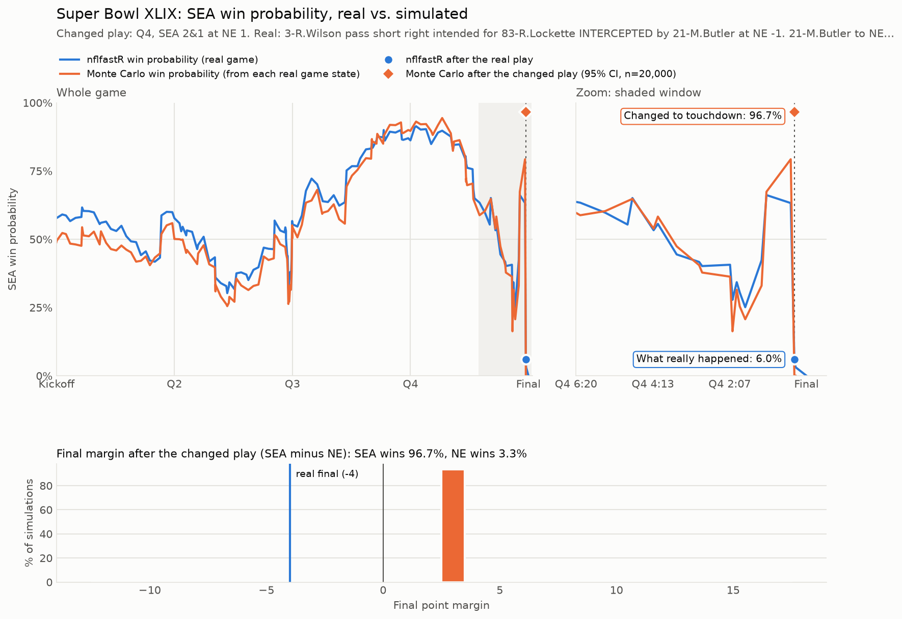

# Super Bowl XLIX what-if

Change the result of any single play in Super Bowl XLIX (Patriots 28, Seahawks 24) and
estimate how often each team wins from there with a Monte Carlo simulation.

Play-by-play comes from [nflreadpy](https://github.com/nflverse/nflreadpy) (nflverse / nflfastR data).



## Quick start

```bash
pip install -r requirements.txt
python -m sb49                    # default: play 4205 (the Butler interception) becomes a touchdown
python -m sb49 --list             # every play with its play_id
python -m sb49 --play-id 4205 --outcome incomplete
python -m sb49 --play-id 4205 --outcome gain --yards 0 --clock-secs 20
python -m sb49 --play-id 4138 --outcome interception --yards 20
python -m sb49 --help             # all outcomes and options
```

Output:

* Win probability for each team after the changed play, with a 95% confidence interval.
* A PNG in `plots/` with three panels:
  * **Whole game:** nflfastR's win probability for the real game (blue) next to this project's
    Monte Carlo win probability, simulated from every real pre-snap state (orange). This checks
    the simulator against an established model.
  * **Zoom:** the minutes around the changed play, with the nflfastR value after what really
    happened and the Monte Carlo value after your changed result.
  * **Final margin:** how the simulated games ended after the change.

The first run downloads the 2014 season (about 5 s) and caches it in `.cache/`.

### Outcomes

| outcome | meaning |
|---|---|
| `touchdown` | offense scores |
| `gain --yards N` | run or completion of N yards (negative = loss). Handles first downs, TDs, safeties and turnover on downs |
| `incomplete` | incomplete pass |
| `interception [--yards N]` / `fumble [--yards N]` | defense takes over N yards past the line of scrimmage (default 0) |
| `defensive_td` | turnover returned for a touchdown |
| `field_goal_made` / `field_goal_missed` | |
| `punt --yards N` | punt with N net yards |
| `safety`, `kneel` | |

`--clock-secs` sets how much time the new play takes off the clock. The default is 5–8 s
for results that stop the clock, otherwise however long the real play took.
`--team` picks whose win probability is plotted.

## How the simulation works

All code is in `sb49/`:

| file | role |
|---|---|
| `data.py` | loads 2014 play-by-play via `nflreadpy.load_pbp` and pulls out game `2014_21_NE_SEA` |
| `model.py` | calibrates the league-wide play model on every other 2014 game (266 games) |
| `simulate.py` | the game engine: downs, scoring, clock, timeouts, kickoffs, punts, 2014 playoff overtime |
| `game.py` | turns real rows into game states, applies your changed result, runs simulations in parallel |
| `plot.py`, `cli.py` | chart and command line |

The model has no fitted play distribution. Each simulated snap **resamples a real 2014
play** from a similar situation: down, distance bucket, field zone, and tempo (normal,
hurry-up when trailing late or before halftime, protecting a late lead). Yards, turnovers
and return touchdowns come from that play. If a situation bucket has too few plays, it
falls back to coarser buckets.

**Clock:** run-off is resampled from real plays with the same tempo and the same
clock-stopping status (incomplete / out of bounds / change of possession vs. clock
running). Plays followed by a timeout or crossing the two-minute warning are left out.
The engine then applies the two-minute warning, timeouts (a trailing offense in hurry-up
uses them after in-bounds plays; a trailing defense uses them against a clock-killing
offense), and kneel-downs when the leader can run out the clock.

**Special teams and decisions:**

* Kickoffs and punts are resampled from real results, including return touchdowns.
* Onside kicks happen when trailing late, with the 2014 recovery rate.
* Field goals use a logistic make-probability curve fitted on kick distance.
* PAT and two-point conversions use their 2014 success rates.
* Fourth downs follow simple 2014-era rules: kick in field-goal range, go for it on
  short yardage near midfield, always go when trailing late.
* Two-point attempts follow the standard late-game chart.

**Overtime:** 2014 playoff rules. A first-possession touchdown wins. A first-possession
field goal gives the other team one possession to answer. After that, next score wins,
and play continues until someone scores.

### How well it matches nflfastR

Simulating from each of the game's 153 real pre-snap states, the Monte Carlo win
probability averages **4.5 points** off nflfastR's. The biggest gap is on the famous play
itself: 2nd & goal at the 1 with 26 seconds and one timeout. This model gives Seattle about
80%, nflfastR 63%. Three tries from the 1 yard line, where 59% of 2014 plays scored,
supports the higher number. nflfastR also gives the Seahawks a home-field edge, although
the game was played at a neutral site.

### Limitations

* Both teams are league-average 2014 teams. There are no team strengths, weather effects
  or play-calling tendencies.
* Penalties are only included when they are part of a run or pass play. Pre-snap
  penalties are ignored.
* Clock and fourth-down decisions follow rules of thumb, not a coach model.
* The confidence interval covers only Monte Carlo sampling error, not model error.

## Tests

```bash
pip install pytest
python -m pytest
```

The tests use a small synthetic model, so they need no network access.
