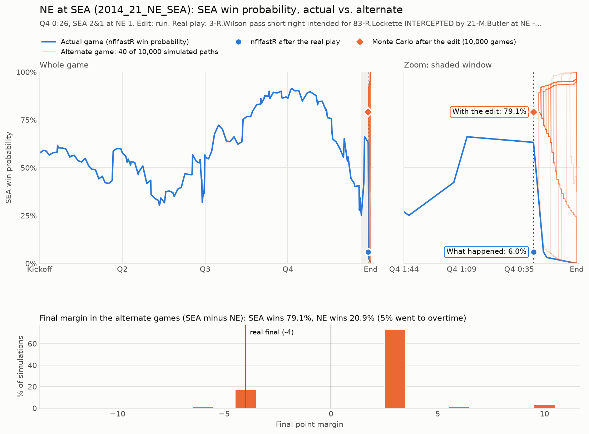
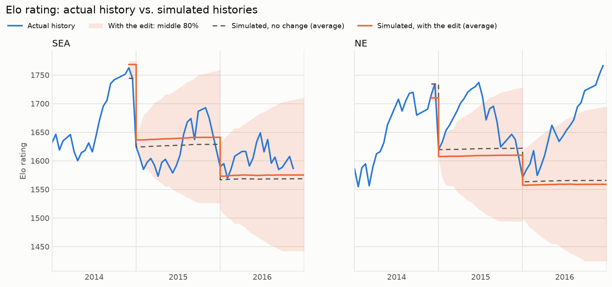

# NFL What If Machine

Pick a significant play from 2010–2019 and change what happened on it. The tool then shows:

1. **How the game probably ends.** It runs 10,000+ simulations of the rest of the game from the edited play.
2. **How the next two seasons might go.** It replays history from that game with an Elo rating system and
   simulates the rest of that season plus the next two, 10,000 times each, on the real schedules. Playoffs
   are included, with each year's seeding and tiebreaker rules.

Every result sits next to two others: what actually happened, and the same simulation run *without* your
change. The difference between the two simulations is the effect of your edit. The model's own noise
affects both simulations equally, so it cancels out of that difference.

Data comes from [nflreadpy](https://github.com/nflverse/nflreadpy) (nflverse play-by-play with nflfastR win
probability and EPA, plus schedules and results). It is cached locally as parquet after the first download.

## First test case: Super Bowl XLIX

Seattle, 2nd and goal at the New England 1, 0:26 left, down 28–24, one timeout. Russell Wilson's pass is
intercepted by Malcolm Butler. **What if Marshawn Lynch gets the handoff instead?**

```bash
python -m whatif run scenarios/sb49_lynch.toml
```

The run's result isn't fixed. It is drawn from real 2012–2016 runs in the same situation (2nd and 1 at the 1,
hurry-up), so sometimes Lynch is stopped. Seattle then has third down with one timeout.

| Seattle win probability | |
|---|---|
| nflfastR before the snap | 63.3% |
| nflfastR after the real play (interception) | 6.0% |
| This model before the snap (normal play call) | 78.0% |
| **This model after the edit (Lynch run), 10,000 games** | **79.1%** (95% CI 78.3–79.9%) |



Replaying 2015 and 2016 (10,000 histories with the edit, 10,000 without it):

| Season | Team | | Wins | Playoffs | Division | Conf. title | Super Bowl |
|---|---|---|---|---|---|---|---|
| 2015 | SEA | actual | 10.0 | yes | – | – | – |
| | | no change | 10.3 | 68.2% | 50.5% | 19.5% | 11.1% |
| | | **with edit** | **10.5** | **71.0%** | **53.4%** | **21.6%** | **12.2%** |
| 2015 | NE | actual | 12.0 | yes | yes | – | – |
| | | no change | 10.5 | 70.5% | 51.6% | 18.6% | 10.5% |
| | | **with edit** | **10.3** | **67.2%** | **48.5%** | **16.7%** | **9.1%** |
| 2016 | SEA | actual | 10.5 | yes | yes | – | – |
| | | no change | 9.2 | 53.2% | 37.0% | 11.6% | 6.4% |
| | | **with edit** | **9.4** | **55.1%** | **38.5%** | **12.3%** | **6.8%** |
| 2016 | NE | actual | 14.0 | yes | yes | yes | yes |
| | | no change | 9.1 | 52.7% | 38.0% | 10.9% | 6.2% |
| | | **with edit** | **9.0** | **50.8%** | **36.6%** | **10.3%** | **5.6%** |



**How to read it.** In Elo terms, the real loss cost Seattle 19 points and a win would have added 12. So
the two worlds leave the Super Bowl about 30 points apart for each team, and half of that survives the
offseason regression toward the mean. So without other changes the ripple is small: roughly
+0.2 wins and +3 points of playoff odds for Seattle in 2015, and the mirror image for New England. The
bigger stories people tell (Seattle's locker room, Lynch's retirement) are not in any box score. That is
what narrative adjustments are for.
[`scenarios/sb49_lynch_narrative.toml`](scenarios/sb49_lynch_narrative.toml) adds three hand-set bumps.
With them, Seattle's 2016 playoff odds go from 53% to 62%
([full output](examples/sb49_lynch_narrative/report.md)).

## Quick start

```bash
cd nfl-what-if-machine
pip install -r requirements.txt
python -m whatif download                  # optional: cache 2010-2019 up front (~45 MB, ~30 s)

# find a game and a play
python -m whatif games --season 2014 --week 21
python -m whatif plays --season 2014 --week 21 --team SEA --top 5          # biggest win-probability swings
python -m whatif plays --game-id 2014_21_NE_SEA --qtr 4 --clock 0:26 --search intercepted

# Part 1 only: rewrite the play, simulate the rest of the game
python -m whatif game --game-id 2014_21_NE_SEA --play-id 4205 --outcome run
python -m whatif game --game-id 2014_21_NE_SEA --play-id 4205 --outcome incomplete --timeouts SEA=0

# Parts 1 and 2 from a scenario file, or entirely from flags
python -m whatif run scenarios/sb49_lynch.toml
python -m whatif run --game-id 2017_19_NO_MIN --play-id 4497 --outcome incomplete \
    --adjust "MIN:2018:-10:Kirk Cousins signs elsewhere"

# the web page
streamlit run app.py
```

Each `run` writes to `output/<name>/`:
- `report.md`
- `odds.csv`
- `summary.json`
- `win_probability.png`
- `elo_trajectory.png`
- `season_odds.png`

`pip install -e .` also installs a `whatif` command.

### The web page

`streamlit run app.py` opens a local page:
1. Pick a season, week and game in the sidebar. Filter plays by quarter, text, or size of the
   win-probability swing, then **click a play**.
2. Choose the new result. A live preview shows the state after the edit. Optionally set the down,
   distance, yard line, score, clock and timeouts by hand.
3. Optionally add narrative adjustments in the editable table.
4. Press **Rewrite history**.

You get win-probability metrics, the win-probability chart, the season odds table, the Elo trajectory,
the teams whose playoff odds moved most, and downloads of the report and CSV.

## Editing a play

| outcome | meaning |
|---|---|
| `run`, `pass` | change the play call. The result is **drawn from real plays** of that type in the same situation, a different one in each simulation |
| `touchdown`, `incomplete`, `spike`, `kneel`, `safety` | fixed results |
| `gain --yards N` / `sack --yards N` | run or catch for N yards (negative = loss) / sack for N yards |
| `interception`, `fumble_lost` `[--yards N]` | the defense takes over N yards past the line of scrimmage (default: at the line) |
| `defensive_td` | turnover returned for a touchdown |
| `field_goal_made`, `field_goal_missed`, `punt --yards N` | kicks |
| `penalty --yards N --penalty-on offense\|defense [--automatic-first-down]` | accepted penalty. Half-the-distance rule applies; the down is replayed |
| `custom` | no play result; start from a state you set by hand |

**State overrides**:
- `--possession SEA`
- `--down 3`
- `--ydstogo 1`
- `--yardline "NE 1"` (also `own 20`, `opp 35`, or yards to the goal)
- `--score SEA=24,NE=28`
- `--clock "Q4 0:20"`
- `--timeouts SEA=1,NE=2`
- `--clock-secs 5` (how long the edited play takes)

Overrides apply to the state *after* the play. For `run`, `pass` and `custom` they apply before the snap.

## Scenario files

```toml
name = "Super Bowl XLIX: Lynch gets the ball"

[play]                       # either game_id + play_id, or filters that match exactly one play
season = 2014
week = 21
team = "SEA"
qtr = 4
clock = "0:26"
search = "INTERCEPTED"

[edit]
outcome = "run"              # plus any of: yards, clock_secs, possession, down, ydstogo, yardline, clock,
                             # score = {SEA = 24, NE = 28}, timeouts = {SEA = 1, NE = 2}

[simulation]
game_sims = 10000
season_sims = 10000
seasons_ahead = 2
seed = 49
teams = ["SEA", "NE"]

[[adjustment]]               # optional narrative adjustments, as many as you like
team = "SEA"
season = 2016
week = 1                     # applied before that week's games (default 1)
elo = 20                     # 25 Elo points is about 1 point of point spread
note = "Marshawn Lynch doesn't retire after 2015"
world = "alternate"          # "alternate" (default), "baseline" or "both"
if_winner = "SEA"            # optional: only in histories where SEA won the changed game
```

## The models

### Part 1: the rest of the game

This is a drive-based Monte Carlo built from nflfastR play-by-play. The calibration seasons are the game's
season ±2, kept inside 2010–2019 (so the era's rules and style match).

- **The drive in progress is finished play by play.** Right after an edit, down, distance and the clock
  decide everything (2nd and goal at the 1 with 26 seconds is not a normal drive). Each snap resamples a
  real run or pass from the same:
  - down
  - distance bucket
  - field zone
  - tempo (normal; hurry-up when trailing late or before halftime; protecting a late lead)

  The resampled play supplies the yards, turnovers and return touchdowns. Clock run-off is resampled from
  real snaps with the same tempo and the same clock status (stopped: incomplete, out of bounds, turnover or
  score; otherwise running). The engine handles:
  - the two-minute warning
  - timeouts, used by a hurrying offense and by a trailing defense
  - kneel-downs when the leader can run out the clock
  - fourth-down decisions: kick in range, go on short yardage near midfield, always go when trailing late
  - field goals at the end of a half
- **Every later possession is one resampled real drive.** Early in a half, a drive is drawn from real
  drives that started in the same field-position band. In the last 8 minutes of the second half (last 2 of
  the first), the draw is also matched on time left and score margin. That's how a team down 3 with 0:20
  left behaves like real teams in that spot. A drive supplies its result (TD, FG, punt, turnover, downs,
  missed FG, safety, opponent TD, end of half), how long it took, and where the opponent's next drive
  started. The field-position flow comes straight from the data.
- **Kicks:**
  - kickoff starting points are resampled from real kickoffs
  - field-goal odds come from a logistic curve on distance
  - PAT and two-point rates are taken per season (the PAT moved back in 2015)
  - onside kicks happen when trailing late, with the era's recovery rate
  - two-point attempts follow the standard late-game chart
- **Overtime** follows each year's rules:
  - regular season: sudden death before 2012, possession rules from 2012
  - playoffs: possession rules from 2010
  - 10-minute regular-season overtime from 2017
  - ties are possible in the regular season
- **Win probability along the alternate paths** (the chart) comes from the simulations themselves.
  At each moment, a path's win probability is the share of simulated games in the same situation (score,
  possession, field position) that the team went on to win. It matches the Monte Carlo number at the edit
  by construction and needs no separate model.

**Checks.**
- A simulated kickoff-to-final game averages 45.5 total points (real 2010–19: 45.3). The average final
  margin is 11.0 (real: 11.6), and 7.5% of games go to overtime (real: 6.0%).
- On 400 random real 2018 situations (`python -m whatif validate`), the Brier score against actual results
  is **0.157**. nflfastR's own model scores 0.150 on the same situations; a coin flip scores 0.250.
- The two models differ by 3.6 points of win probability on average.

### Part 2: Elo and the next seasons

**Elo, FiveThirtyEight-style.**
- Win probability is `1 / (1 + 10^(-d/400))`, where `d` = home − away + home-field advantage (none at
  neutral sites), times a playoff multiplier.
- Updates are `K × MOV multiplier × (result − probability)`, using 538's multiplier
  `ln(|margin|+1) × 2.2 / (0.001 × d_winner + 2.2)`. This damps blowouts by heavy favorites.
- Between seasons, ratings regress toward 1505.
- Ratings warm up from 2002 and are **calibrated by grid search on Brier score over all 2,670 games of
  2010–2019** (`python -m whatif elo`):

| | K | home field | regression | playoff × | Brier | picks winner |
|---|---|---|---|---|---|---|
| **calibrated** | 20 | 48 | 0.50 | 1.0 | **0.2185** | 64.9% |
| 538's defaults | 20 | 65 | 1/3 | 1.2 | 0.2192 | 64.7% |
| always pick the home team | | | | | 0.2446 | 56.9% |

**Replaying history.**
1. Real results are replayed up to the changed game.
2. The changed game gets its alternate result: each of the 10,000 histories takes one simulated final score
   from Part 1, so a 79% Seattle win means 79% of histories have Seattle as champion. The baseline world
   uses the real score.
3. Everything after the changed game is simulated:
   - the rest of that regular season, if the change came before it ended
   - that season's playoffs, re-simulated from the changed game on
   - the next two seasons in full, on the real schedules (neutral sites, byes, 16 or 17 games)
4. Simulations are "hot": ratings update after every simulated game.
5. Simulated margins are drawn from real games with a similar Elo gap and the same result (the favorite won
   or lost). Otherwise the margin damping would pull simulated ratings toward the mean.

**Playoffs.**
- Seeding: 6 teams per conference through 2019, 7 from 2020. Division winners are seeds 1–4, then wild
  cards; the divisional round is reseeded; the Super Bowl is at a neutral site.
- Tiebreakers follow the NFL procedure:
  - head-to-head (for wild-card ties of 3+ teams, only if one team swept the others)
  - division record
  - common games (at least 4 for wild cards)
  - conference record
  - strength of victory
  - strength of schedule
  - coin flip

  Teams are placed one at a time, and the procedure restarts with the teams still tied. Starting from real
  standings, this reproduces **every real playoff field and wild-card matchup from 2010 to 2021**. That is
  a test in `tests/test_seasons.py`.

**Narrative adjustments** are Elo bumps you set by hand, each with a note. They apply from a given season
and week, in the alternate world by default. They can be limited to histories where a given team won the
changed game.

## Limitations

- **Both teams are league-average in Part 1.** The game simulator has no team strength, home-field edge,
  weather or player information: every drive is a real 2010s drive by *somebody*. That's why it rates home
  teams a bit below how often they actually win (see `validate`), and why its numbers can differ from
  nflfastR's, which accounts for home field and the point spread.
- **Late-game detail is approximate.** Only the drive in progress uses down, distance, timeouts and the
  clock. Later drives are matched only on field position, time and score, so timeouts, spikes and the
  two-minute warning are only as good as the average real drive in that spot. Pre-snap penalties are
  ignored, and penalties are only included when they're part of a run or pass. Kickoff return touchdowns
  aren't modelled.
- **Play calling follows rules of thumb.** Fourth downs, kneels and two-point tries use simple rules, not
  a coach model.
- **Elo only knows scores.** It can't tell *why* a team was good: no quarterback changes, injuries, draft
  picks or free agency, and there is no mechanism by which one game changes a roster. Flipping a single game moves
  a team's Elo by about 20–30 points (half of it gone after the offseason), so the modeled ripple from any
  single play is small. Anything bigger has to come
  from narrative adjustments, which are opinions.
- **Regression makes the future look average.** Simulated seasons pull every team toward 8–9 wins. The
  actual 2016 Patriots (14–2) sit far outside what an Elo simulation from 2015 could see. Compare the two
  simulated worlds with each other, not with the actual column.
- **Confidence intervals cover simulation noise only.** Model error (wrong structure or assumptions) is
  usually larger.
- **2020+ seasons** use their real schedules and the 7-team format, but the game simulator is only
  calibrated on 2010–2019.

## Project layout

| file | role |
|---|---|
| `whatif/data.py` | nflreadpy loading, parquet cache (`data_cache/`, or `$WHATIF_CACHE`), game and play search |
| `whatif/models.py` | play, drive and kick models calibrated from play-by-play |
| `whatif/gamesim.py` | the game engine (play by play for the current drive, then drive by drive) |
| `whatif/rewrite.py` | real play → game state, edits, parallel Monte Carlo, Part 1 pipeline |
| `whatif/elo.py` | Elo formulas, history replay, calibration |
| `whatif/seasonsim.py` | vectorized season and playoff simulation, tiebreakers, narrative adjustments |
| `whatif/scenario.py` | scenario files, full pipeline, reports |
| `whatif/charts.py` | win probability, Elo trajectory and odds table charts |
| `whatif/validate.py` | game simulator vs real outcomes and nflfastR |
| `whatif/cli.py`, `app.py` | command line and Streamlit page |

## Tests

```bash
python -m pytest            # 31 tests; the data-backed ones download and cache nflverse data on first run
WHATIF_OFFLINE=1 python -m pytest   # only the tests that need no data
```
